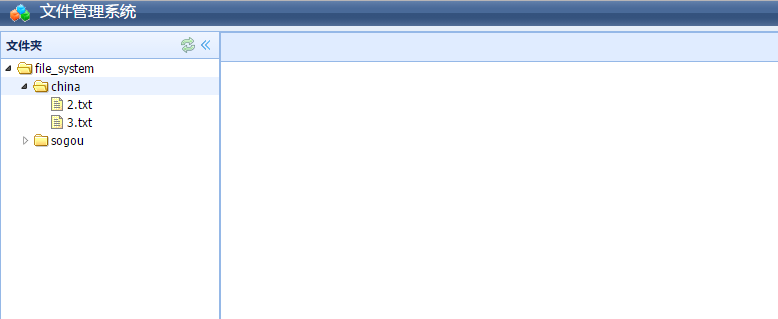
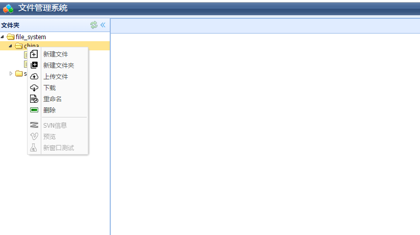
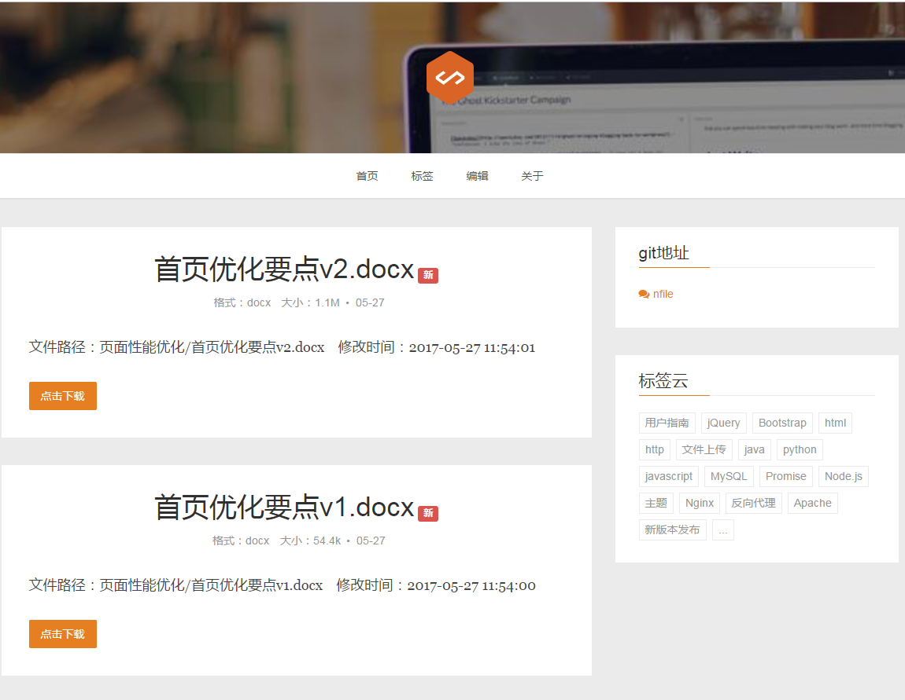

# SogouTool
## description
A file system based on nodejs & easyui. You can use it to edit / view / upload / download file.

## how to run it.
```bash
# prepare directory(it makes deploy more easier.)
mkdir -p /shushanfx/node/data
cd /shushanfx/node
# check out from github 
git clone "https://github.com/shushanfx/nfile.git"
# install dependencies and start it.
cd nfile
npm install && npm start
```
> use `npm run dev` for development and make use you have already installed [`supervisor`](https://www.npmjs.com/package/supervisor).

## config
You can adjust the config as your wish. Config is placed in `server.json`.
```javascript
{
    "port": 18081,
    "name": "File System",
    "cnName": "文件管理系统",
    "company": "shushanfx.com",
    "description": "文件管理系统",
    "base": "/", // you can set to /nfile
    "workspace": {
        "path": "/shushanfx/node/data", // file path.
        "workspace": "/shushanfx/node/nfile"
    }
}
```

> When the `base` parameter is not null or `/`, it means that you have set a prefix for your webside, thus you must browser your website by `http://${host}:${port}/${base}`

## preview
It looks like the follow:    



Add a new preview path`/file/list`, it can display like this:



## Thanks
Thanks to those who made contribution a lot:
* [shushanfx]
* [dengjianxin]

## Deloy with docker
Those days, i tried to delopy the project on docker, fortunately, it successed. The deploy command as follow:  

```bash
# docker command
docker run --name shushanfx-node -v /shushanfx/node/data:/shushanfx/node/data -v /shushanfx/node/nfile:/usr/src/app -p 127.0.0.1:18081:18081 -d node:onbuild sh -c "npm install && npm start"
```

>* Mount two direcories:/shushanfx/node/data to /shushanfx/node/data(in docker container), /shushanfx/node/nfile to /usr/src/app(in docker container).
>* Parameter -d means run in background
>* The command `sh -c "npm install && npm start"`, which execute two commands in one time, you must use `sh -c [parameter]`, or the second command will be executed in docker container.

## SSH into docker image
In case you need to ssh into the docker image you can do so:
```bash
# asume the docker name is shushanfx-node
docker exec -t -i shushanfx-node /bin/bash
```

You can refer `docker exec` command [here](https://docs.docker.com/engine/reference/commandline/exec/)

## With Nginx
If you want to deloy the server by nginx, you can make the nginx config like this:

```conf
upstream node_file {
        server 127.0.0.1:18081;
        keepalive 10;
}

server {
        listen 80;
        server_name your.server.name;

        # use nginx to server static file. 
        root /shushanfx/node/nfile/static;

        location ~* \.(js|css|png|gif|jpg|ico) {
                expires 30d;
        }
        location / {
                proxy_pass http://node_file;
                proxy_set_header Host "your.server.name";
                proxy_set_header X-Real-IP $remote_addr;
                proxy_set_header X-Forwarded-For $proxy_add_x_forwarded_for;
                proxy_connect_timeout 2;
                proxy_read_timeout 5;
        }
}

```

## Change logs
Please refer to [change logs](doc/changelog.md)